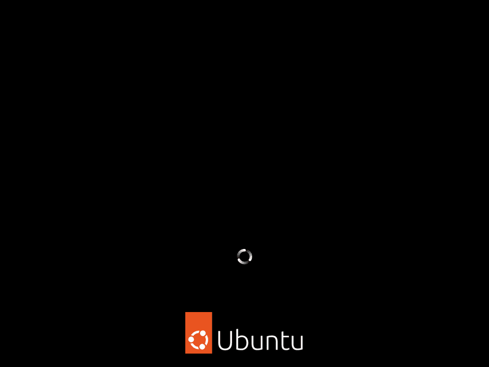
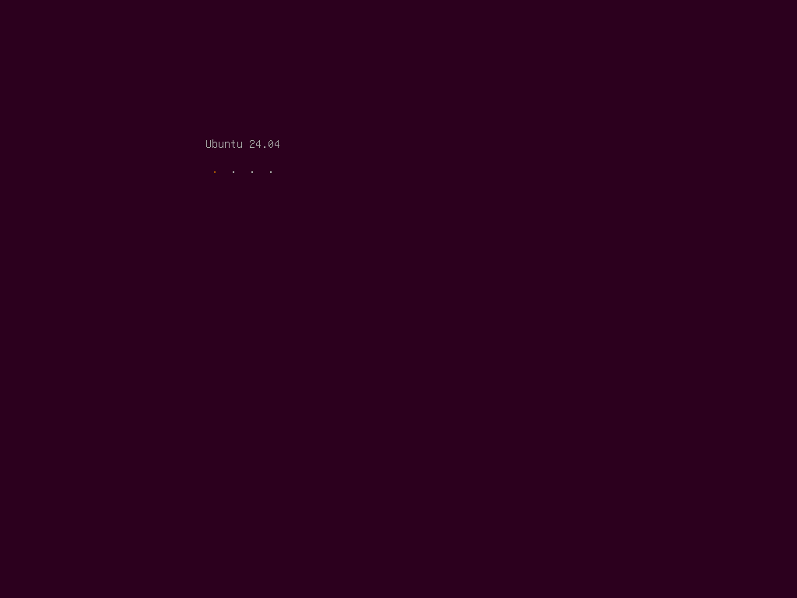

= lp2081579 snap tpm fde failure
:hide-uri-scheme:
// Enable keyboard macros
:experimental:
:toc:
:toclevels: 4
:icons: font
:note-caption: ℹ️
:tip-caption: 💡
:warning-caption: ⚠️
:caution-caption: 🔥
:important-caption: ❗

// cspell:ignore NVME mountpoints oneshot nvme Zpools bootable

== Observation

An affected system fails to boot properly.
Systems with more than one NVME drive, and eventually one ore more PCI-E quad M.2 expansion cards,
change the ordering of the NVME drives, which causes problems with the, currently experimental, TPM FDE encryption.

Identification:

* The system boots up in *normal mode* and shows the *graphical spinner during boot* with black background
+

* The system boots up in *failure mode* and only shows the *text spinner during boot* with purple background
  (depends on chosen theme, purple is for the default Ubuntu Gnome Desktop),
  it will boot to the graphical display manager just fine, but functionality like previously imported Zpools won't be imported

== Quick fix

On some setups, like mine, it helps to press kbd:[Ctrl+Alt+Del] as soon as you see the text spinner to trigger a reboot.
The following boot usually boots in normal mode and nothing needs to be done.
All previously imported Zpools will be available.
Snapd will be working as expected.

== Detecting and fixing the disk mapping

If you have more than one NVME drive, and you can observe that your setup changes the ordering of the drives,
then it is likely that you will encounter problems with the, currently experimental, TPM FDE encryption.

The file `/var/lib/snapd/device/disk-mapping.json` is readable by any user on the machine and every user can run `lsblk`.
I wrote a script that will inform you when your setup has changed and your root partition is mounted from a different drive.
You should then take preventive action and maintenance before any updates get installed which may render the system not bootable or not repairable.

At the moment you will also notice that snapd stops working, but my hope is that this issue gets resolved before the disk mapping issue.

=== Setup of the script

[source,bash]
----
mkdir -pv "${HOME}/.local/bin/"

# Create the script.
tee "${HOME}/.local/bin/snap_tpm_fde_check.sh" << EOF
#!/bin/bash

disk_mapping_file="/var/lib/snapd/device/disk-mapping.json"
lsblk_tpm_fde_dev="$(
  lsblk --json \
  | jq -r '.blockdevices[] | select(.children[]?.mountpoints[]? == "/run/mnt/ubuntu-seed") | .name'
)"
disk_mapping_dev="$(jq -r '.pc."kernel-path"' "${disk_mapping_file}")"

if [[ "/dev/${lsblk_tpm_fde_dev}" == "${disk_mapping_dev}" ]]; then
  # Send to journal/shell.
  echo "No issue found."

  # Send desktop notification.
  # notify-send "TPM-FDE Check" "No issue found."
else
  # Send to journal/shell.
  echo "Error:   The disk mapping has changed."
  echo "Current: /dev/${lsblk_tpm_fde_dev}"
  echo "Before:  ${disk_mapping_dev}"
  echo "Please check ${disk_mapping_file}."

  # Send desktop notification.
  notify-send "TPM-FDE Check" \
    "Error: The disk mapping has changed. Current: /dev/${lsblk_tpm_fde_dev}, before: ${disk_mapping_dev}. Please check ${disk_mapping_file}."
fi
EOF

# Create the service unit.
tee "${HOME}/.local/share/systemd/user/snap-tpm-fde-check.service" << EOF
[Unit]
Description=Detect TPM FDE device mismatch
Documentation=https://github.com/lwbt/lp2081579_snap_tpm_fde_failure

[Service]
Type=oneshot
ExecStart=/bin/bash -c '${HOME}/.local/bin/snap_tpm_fde_check.sh'

[Install]
WantedBy=multi-user.target
EOF

# Create the timer unit.
tee "${HOME}/.local/share/systemd/user/snap-tpm-fde-check.timer" << EOF
[Unit]
Description=Detect TPM FDE device mismatch

[Timer]
OnBootSec=5min
OnUnitActiveSec=24h
AccuracySec=30min

[Install]
WantedBy=timers.target
EOF

# Activate the timer unit.
systemctl --user daemon-reload
systemctl --user enable --now snap-tpm-fde-check.timer

# Check the status.
systemctl --user status snap-tpm-fde-check.service
systemctl --user list-timers snap-tpm-fde-check.timer
----

=== Fixing the issue after detection

* Make a backup copy of the file `/var/lib/snapd/device/disk-mapping.json`
* Edit the file: +
  `sudo vim /var/lib/snapd/device/disk-mapping.json`
** Press `:` to enter command mode
** Enter this command `%s/nvme_1/nvme_2/gc`.
   Replace `_1` with the previous device number and `_2` with the current device number without under scores.
   Hit enter and confirm every occurrence with `y`.
** Close vim with `:wq`
* Check that `snap list` can be executed.
** If it does not execute within a few seconds check `systemctl --failed` and further investigate or restart failed units.

[TIP]
====
Ubuntu started to ship `vim-tiny` by default, you might want to install and use
the full vim package (the command stays the same) or another editor that is
safe to use with administrative privileges and with which you are comfortable
with.
====

[IMPORTANT]
====
The full script can automatically fix the file when `fix` is provided as the first parameter.
While this is the most comfortable way, it is also a risk, because you are changing data of a publicly not well documented file.
I recommend to always check the modifications made and if the data structure has changed.
====
